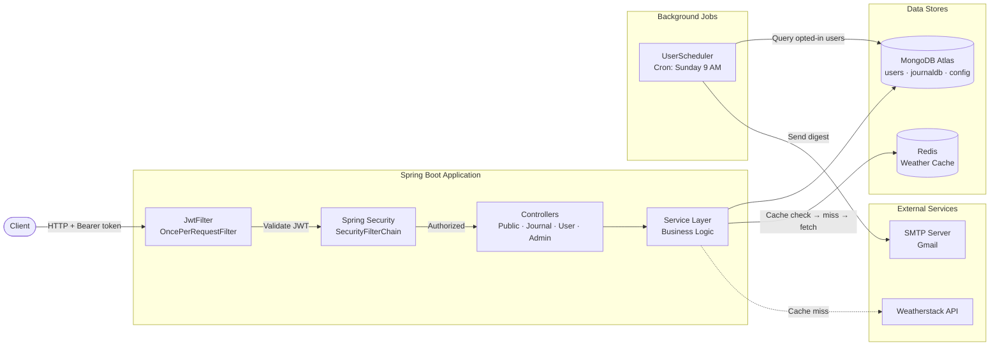
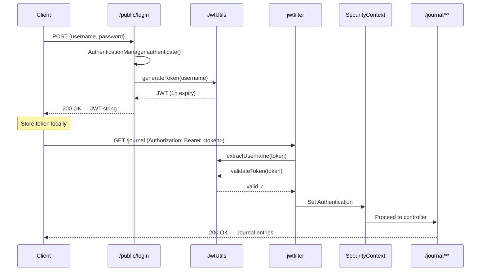
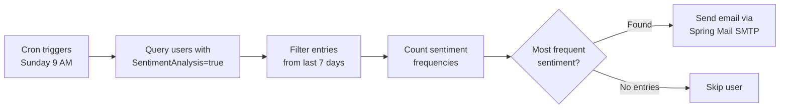

<div align="center">

# 📝 DayScript

**A production-grade Journaling & Sentiment Analysis REST API**

Built with Spring Boot 4 · Secured with JWT · Backed by MongoDB & Redis

[](https://openjdk.org/projects/jdk/21/)
[](https://spring.io/projects/spring-boot)
[](https://www.mongodb.com/)
[](https://redis.io/)
[](https://jwt.io/)
[](LICENSE)

---

*DayScript is a secure, feature-rich backend API for journaling applications. Users create personal journal entries tagged with emotional sentiments, receive weekly email digests analyzing their mood patterns, and get greeted with real-time weather data — all behind stateless JWT authentication.*

</div>

---

## Table of Contents

- [Features](#-features)
- [Architecture](#-architecture)
- [Tech Stack](#-tech-stack)
- [Project Structure](#-project-structure)
- [Getting Started](#-getting-started)
- [Configuration](#%EF%B8%8F-configuration)
- [Authentication Flow](#-authentication-flow)
- [API Reference](#-api-reference)
- [Data Models](#-data-models)
- [Background Jobs](#-background-jobs)
- [Security Notes](#-security-notes)

---

## ✨ Features

| Feature | Description |
|:---|:---|
| 🔐 **JWT Authentication** | Stateless token-based auth with 1-hour expiry. Custom `OncePerRequestFilter` extracts and validates tokens on every request. |
| 📓 **Journal CRUD** | Full create / read / update / delete lifecycle for journal entries, each linked to the authenticated user via MongoDB `@DBRef`. |
| 🧠 **Sentiment Tagging** | Every entry can carry an emotional tag — `HAPPY`, `SAD`, `ANGRY`, or `ANXIOUS` — stored as a first-class enum field. |
| 📬 **Weekly Email Digest** | A cron job runs every **Sunday at 9:00 AM**, queries each opted-in user's entries from the past 7 days, finds the most frequent sentiment, and emails a summary. |
| 🌤️ **Weather Greeting** | Integrates with the [Weatherstack API](https://weatherstack.com/) to greet users with real-time "feels like" temperature data. |
| ⚡ **Redis Caching** | Weather API responses are cached in Redis with a **300-second TTL** to minimize external network calls. |
| ⚙️ **Dynamic Config** | Application properties are loaded from a `config_journal_app` MongoDB collection at startup, enabling runtime configuration without redeployment. |
| 🛡️ **Admin Controls** | Dedicated admin endpoints for user management and cache reset, gated behind `ROLE_ADMIN` authorization. |
| 🔄 **MongoDB Transactions** | Write operations that touch both `journaldb` and `users` collections are wrapped in `@Transactional` for atomicity. |

---

## 🏗 Architecture



**Request lifecycle:**
1. Client sends an HTTP request with `Authorization: Bearer <token>` header.
2. `jwtfilter` (extends `OncePerRequestFilter`) intercepts the request, extracts the JWT, validates expiry via `JwtUtils`, and loads `UserDetails` into the `SecurityContext`.
3. Spring Security's `SecurityFilterChain` enforces route-level rules:
   - `/public/**` → open to all
   - `/journal/**`, `/user/**` → requires authentication
   - `/admin/**` → requires `ROLE_ADMIN`
4. The matched controller delegates to the service layer, which interacts with MongoDB (and optionally Redis).

---

## 🛠 Tech Stack

| Layer | Technology | Purpose |
|:---|:---|:---|
| **Runtime** | Java 21 | Language & JDK |
| **Framework** | Spring Boot 4.0.6 | Web, Security, Mail, Scheduling |
| **Database** | MongoDB (Spring Data) | Primary data store with `MongoTemplate` for custom queries |
| **Caching** | Redis (Spring Data Redis) | Weather response caching with configurable TTL |
| **Auth** | JJWT 0.12.7 | JWT generation, signing (HMAC-SHA), and validation |
| **Email** | Spring Mail + JavaMailSender | Weekly sentiment digest emails via SMTP |
| **Utilities** | Lombok 1.18.46 | Boilerplate reduction (`@Data`, `@Slf4j`, `@NoArgsConstructor`) |
| **Testing** | JUnit 5, Mockito, Spring Boot Test | Unit & integration testing |
| **Build** | Maven (via `mvnw` wrapper) | Dependency management & build lifecycle |

---

## 📂 Project Structure

```
src/main/java/com/example/j2/
│
├── AppCache/                          # Startup configuration cache
│   └── appcache.java                  #   Loads key-value pairs from MongoDB → HashMap
│
├── Config/                            # Spring configuration beans
│   ├── SpringSecurity.java            #   SecurityFilterChain, BCrypt, AuthenticationManager
│   └── RedisConfig.java               #   RedisTemplate with String serializers
│
├── Constants/                         # Shared constants & placeholders
│
├── Controller/                        # REST API endpoints
│   ├── PublicController.java          #   POST /public/create-user, /public/login
│   ├── c1.java                        #   CRUD /journal (JournalController)
│   ├── usercontroller.java            #   GET/PUT/DELETE /user, /user/external-api
│   ├── Admincontroller.java           #   /admin/all-users, /admin/create-admin-user, /admin/clear-cache
│   ├── healthcheck.java               #   GET /test (dev health check)
│   └── check2.java                    #   GET /dbinfo (returns connected DB name)
│
├── Enum/
│   └── Sentiment.java                 #   HAPPY, SAD, ANGRY, ANXIOUS
│
├── Filter/
│   └── jwtfilter.java                 #   OncePerRequestFilter — JWT extraction & validation
│
├── Scheduler/
│   └── UserScheduler.java             #   @Scheduled cron for weekly sentiment emails
│
├── Services/                          # Business logic layer
│   ├── journalentryservice.java       #   Journal CRUD with @Transactional
│   ├── userservice.java               #   User CRUD, BCrypt password encoding
│   ├── Userdetailserviceimpl.java     #   Spring Security UserDetailsService
│   ├── WeatherService.java            #   Weatherstack API integration
│   ├── RedisService.java              #   Generic Redis get/set with TTL
│   ├── EmailService.java              #   SimpleMailMessage sender
│   └── SentimentAnalysis.java         #   Sentiment analysis service
│
├── Utils/
│   └── JwtUtils.java                  #   Token generation (1h expiry), parsing, validation
│
├── entity/                            # MongoDB document models
│   ├── User.java                      #   users collection
│   ├── journalentry.java              #   journaldb collection
│   ├── Weather_external_api.java      #   Weatherstack API response DTO
│   └── ConfigJournalAppEntity.java    #   config_journal_app collection
│
├── repo/                              # Data access layer
│   ├── a1.java                        #   MongoRepository<journalentry>
│   ├── userrepo.java                  #   MongoRepository<User> + findByusername
│   ├── ConfigJournalApp.java          #   MongoRepository<ConfigJournalAppEntity>
│   └── UserImpl_custom_mongo.java     #   MongoTemplate-based custom query for SA users
│
└── J2Application.java                 # Main class — @EnableTransactionManagement
```

---

## 🚀 Getting Started

### Prerequisites

| Dependency | Version | Notes |
|:---|:---|:---|
| **Java JDK** | 21+ | [Download](https://adoptium.net/) |
| **MongoDB** | 6.0+ | [Atlas (cloud)](https://www.mongodb.com/atlas) or local install |
| **Redis** | 7.0+ | [Download](https://redis.io/download/) or Docker: `docker run -p 6379:6379 redis` |

### 1. Clone the repository

```bash
git clone https://github.com/kavishvachhet/DayScript.git
cd DayScript
```

### 2. Configure environment

Copy and edit the properties file (see [Configuration](#%EF%B8%8F-configuration) below):

```bash
# Edit with your credentials
notepad src/main/resources/application.properties
```

### 3. Run the application

```bash
# Linux / macOS
./mvnw spring-boot:run

# Windows
mvnw.cmd spring-boot:run
```

The server starts on **`http://localhost:8080`** by default.

### 4. Verify

```bash
# Should return the connected database name
curl http://localhost:8080/dbinfo
```

---

## ⚙️ Configuration

Edit `src/main/resources/application.properties` with your credentials:

```properties
# ─── MongoDB ──────────────────────────────────────────────
spring.data.mongodb.uri=mongodb+srv://<username>:<password>@cluster0.mongodb.net/JournalentriesDb

# ─── Redis ────────────────────────────────────────────────
spring.data.redis.host=localhost
spring.data.redis.port=6379

# ─── Weatherstack API ────────────────────────────────────
weather.api.key=YOUR_WEATHERSTACK_API_KEY

# ─── SMTP (Gmail) ────────────────────────────────────────
spring.mail.host=smtp.gmail.com
spring.mail.port=587
spring.mail.username=your-email@gmail.com
spring.mail.password=your-app-password
spring.mail.properties.mail.smtp.auth=true
spring.mail.properties.mail.smtp.starttls.enable=true
```

> **💡 Tip:** For Gmail, generate an [App Password](https://myaccount.google.com/apppasswords) instead of using your real password.

---

## 🔑 Authentication Flow

DayScript uses **stateless JWT authentication**. Tokens are signed with HMAC-SHA256 and expire after **1 hour**.



---

## 📖 API Reference

### Public Endpoints — `/public`

<details>
<summary><code>POST</code> <code>/public/create-user</code> — Register a new user</summary>

**Request Body:**
```json
{
  "username": "kavish",
  "password": "mypassword",
  "email": "kavish@example.com",
  "SentimentAnalysis": true
}
```

**Response:** `200 OK` (empty body)

**Notes:** Password is hashed with BCrypt before storage. The `USER` role is assigned automatically.

**Example:**
```bash
curl -X POST http://localhost:8080/public/create-user \
  -H "Content-Type: application/json" \
  -d '{"username":"kavish","password":"mypassword","email":"kavish@example.com","SentimentAnalysis":true}'
```
</details>

<details>
<summary><code>POST</code> <code>/public/signup</code> — Sign up a new user</summary>

**Request Body:**
```json
{
  "username": "kavish",
  "password": "mypassword",
  "email": "kavish@example.com"
}
```

**Response:** `200 OK` (empty body)

**Example:**
```bash
curl -X POST http://localhost:8080/public/signup \
  -H "Content-Type: application/json" \
  -d '{"username":"kavish","password":"mypassword","email":"kavish@example.com"}'
```
</details>

<details>
<summary><code>POST</code> <code>/public/login</code> — Authenticate and receive a JWT</summary>

**Request Body:**
```json
{
  "username": "kavish",
  "password": "mypassword"
}
```

**Response:** `200 OK`
```
eyJhbGciOiJIUzI1NiIsInR5cCI6IkpXVCJ9.eyJzdWIiOiJrYXZpc2giLC...
```

**Error Response:** `400 Bad Request`
```
Incorrect Username or Password
```

**Example:**
```bash
# Save the token to a variable for reuse
TOKEN=$(curl -s -X POST http://localhost:8080/public/login \
  -H "Content-Type: application/json" \
  -d '{"username":"kavish","password":"mypassword"}')

echo $TOKEN
```
</details>

---

### Journal Endpoints — `/journal` 🔒

> All endpoints require `Authorization: Bearer <token>` header.

<details>
<summary><code>GET</code> <code>/journal/app</code> — Test journal endpoint</summary>

**Response:** `200 OK`
```
Hello
```

**Example:**
```bash
curl http://localhost:8080/journal/app \
  -H "Authorization: Bearer $TOKEN"
```
</details>

<details>
<summary><code>GET</code> <code>/journal</code> — Get all journal entries</summary>

**Response:** `200 OK`
```json
[
  {
    "id": "684793a1e2f8bc001a5d9e42",
    "title": "Morning walk",
    "content": "Felt refreshed after a long walk in the park.",
    "date": "2026-06-10T08:30:00",
    "sentiment": "HAPPY"
  }
]
```

**Response (no entries):** `404 Not Found`

**Example:**
```bash
curl http://localhost:8080/journal \
  -H "Authorization: Bearer $TOKEN"
```
</details>

<details>
<summary><code>POST</code> <code>/journal</code> — Create a new entry</summary>

**Request Body:**
```json
{
  "title": "Stressful deadline",
  "content": "Worked overtime to meet the project deadline. Feeling drained.",
  "sentiment": "ANXIOUS"
}
```

**Response:** `201 Created`
```json
{
  "id": "684793a1e2f8bc001a5d9e43",
  "title": "Stressful deadline",
  "content": "Worked overtime to meet the project deadline. Feeling drained.",
  "date": "2026-06-10T12:00:00",
  "sentiment": "ANXIOUS"
}
```

**Notes:** The `date` field is set server-side to `LocalDateTime.now()`. The entry is saved atomically via `@Transactional` — both the entry document and the user's `journalentries` reference array are updated together.

**Example:**
```bash
curl -X POST http://localhost:8080/journal \
  -H "Authorization: Bearer $TOKEN" \
  -H "Content-Type: application/json" \
  -d '{"title":"Stressful deadline","content":"Worked overtime.","sentiment":"ANXIOUS"}'
```
</details>

<details>
<summary><code>GET</code> <code>/journal/id/{id}</code> — Get entry by ID</summary>

**Response:** `200 OK` — Returns the entry if it belongs to the authenticated user.

**Response (not found / not owned):** `404 Not Found`

**Example:**
```bash
curl http://localhost:8080/journal/id/684793a1e2f8bc001a5d9e42 \
  -H "Authorization: Bearer $TOKEN"
```
</details>

<details>
<summary><code>PUT</code> <code>/journal/id/{id}</code> — Update an entry</summary>

**Request Body** (partial updates supported):
```json
{
  "title": "Updated title",
  "content": "Updated content with more details."
}
```

**Notes:** Only non-null, non-empty fields are updated. Omitting a field keeps the existing value.

**Example:**
```bash
curl -X PUT http://localhost:8080/journal/id/684793a1e2f8bc001a5d9e42 \
  -H "Authorization: Bearer $TOKEN" \
  -H "Content-Type: application/json" \
  -d '{"title":"Updated title"}'
```
</details>

<details>
<summary><code>DELETE</code> <code>/journal/id/{id}</code> — Delete an entry</summary>

**Response:** `204 No Content` — Entry deleted successfully.

**Response (not found):** `404 Not Found`

**Notes:** Deletion is transactional — removes the entry from both the `journaldb` collection and the user's `journalentries` reference list.

**Example:**
```bash
curl -X DELETE http://localhost:8080/journal/id/684793a1e2f8bc001a5d9e42 \
  -H "Authorization: Bearer $TOKEN"
```
</details>

---

### User Endpoints — `/user` 🔒

<details>
<summary><code>GET</code> <code>/user</code> — List all users (debug)</summary>

**Response:** `200 OK` — Returns all user documents.

```bash
curl http://localhost:8080/user \
  -H "Authorization: Bearer $TOKEN"
```
</details>

<details>
<summary><code>PUT</code> <code>/user</code> — Update credentials</summary>

**Request Body:**
```json
{
  "username": "new_username",
  "password": "new_password"
}
```

**Response:** `204 No Content`

```bash
curl -X PUT http://localhost:8080/user \
  -H "Authorization: Bearer $TOKEN" \
  -H "Content-Type: application/json" \
  -d '{"username":"kavish_v2","password":"newpass123"}'
```
</details>

<details>
<summary><code>DELETE</code> <code>/user</code> — Delete account</summary>

**Response:** `204 No Content` — Permanently deletes the authenticated user.

```bash
curl -X DELETE http://localhost:8080/user \
  -H "Authorization: Bearer $TOKEN"
```
</details>

<details>
<summary><code>GET</code> <code>/user/external-api</code> — Weather greeting</summary>

**Response:** `200 OK`
```
Hi kavish, Weather feels like 32
```

**Notes:** Fetches current weather for Mumbai from [Weatherstack](https://weatherstack.com/). The response is cached in Redis for 5 minutes (300s TTL) to avoid redundant API calls.

```bash
curl http://localhost:8080/user/external-api \
  -H "Authorization: Bearer $TOKEN"
```
</details>

---

### Admin Endpoints — `/admin` 🔒👑

> Requires `ROLE_ADMIN`. Create an admin via `POST /admin/create-admin-user`.

| Method | Route | Description |
|:---|:---|:---|
| `GET` | `/admin/all-users` | Retrieve all registered users |
| `POST` | `/admin/create-admin-user` | Register a user with `[USER, ADMIN]` roles |
| `GET` | `/admin/clear-cache` | Flush and reload the `config_journal_app` cache |

---

### Utility Endpoints (open)

| Method | Route | Description |
|:---|:---|:---|
| `GET` | `/dbinfo` | Returns the connected MongoDB database name |
| `GET` | `/test` | Health check — Verifying Backend is Working or not. |

---

## 🗄 Data Models

### `users` collection

```json
{
  "_id":                "ObjectId",
  "username":           "String — unique, indexed, required",
  "password":           "String — BCrypt hashed, required",
  "email":              "String — used for weekly digest emails",
  "SentimentAnalysis":  "Boolean — opt-in flag for email reports",
  "journalentries":     "List<DBRef> — references to journaldb documents",
  "roles":              "List<String> — e.g. [\"USER\"] or [\"USER\", \"ADMIN\"]"
}
```

### `journaldb` collection

```json
{
  "_id":        "ObjectId",
  "title":      "String",
  "content":    "String",
  "date":       "LocalDateTime — set server-side on creation",
  "sentiment":  "String — enum: HAPPY | SAD | ANGRY | ANXIOUS"
}
```

### `config_journal_app` collection

```json
{
  "key":    "String — configuration property name",
  "value":  "String — configuration property value"
}
```

> Loaded into an in-memory `HashMap` at startup by `appcache.java`. Can be refreshed at runtime via `GET /admin/clear-cache`.

---

## ⏰ Background Jobs

### Weekly Sentiment Email Digest

| Property | Value |
|:---|:---|
| **Schedule** | `0 0 9 * * SUN` — Every Sunday at 9:00 AM |
| **Target users** | Users where `SentimentAnalysis == true` (queried via `MongoTemplate`) |
| **Logic** | Filters journal entries from the last 7 days → counts sentiments → finds most frequent → sends email |
| **Email subject** | `"Sentiment For Last 7 Days"` |
| **Email body** | The dominant sentiment name (e.g., `"HAPPY"`) |



---

## 🔒 Security Notes

| Aspect | Implementation |
|:---|:---|
| **Password storage** | BCrypt via `BCryptPasswordEncoder` — passwords are never stored in plaintext |
| **Session management** | `STATELESS` — no server-side sessions; every request must carry a JWT |
| **Token expiry** | 1 hour (`1000 * 60 * 60` ms) |
| **Token signing** | HMAC-SHA256 via JJWT |
| **CSRF** | Disabled (appropriate for stateless REST APIs) |
| **Filter chain** | `jwtfilter` is inserted before `UsernamePasswordAuthenticationFilter` |
| **Route protection** | `/journal/**` & `/user/**` → authenticated; `/admin/**` → `ROLE_ADMIN`; everything else → open |

> ⚠️ **Before deploying to production**, move the JWT secret key from the hardcoded string in `JwtUtils.java` to an environment variable or secrets manager.

---

<div align="center">

**Built with ❤️ by Kavish**

*If this project helped you, consider giving it a ⭐*

</div>
